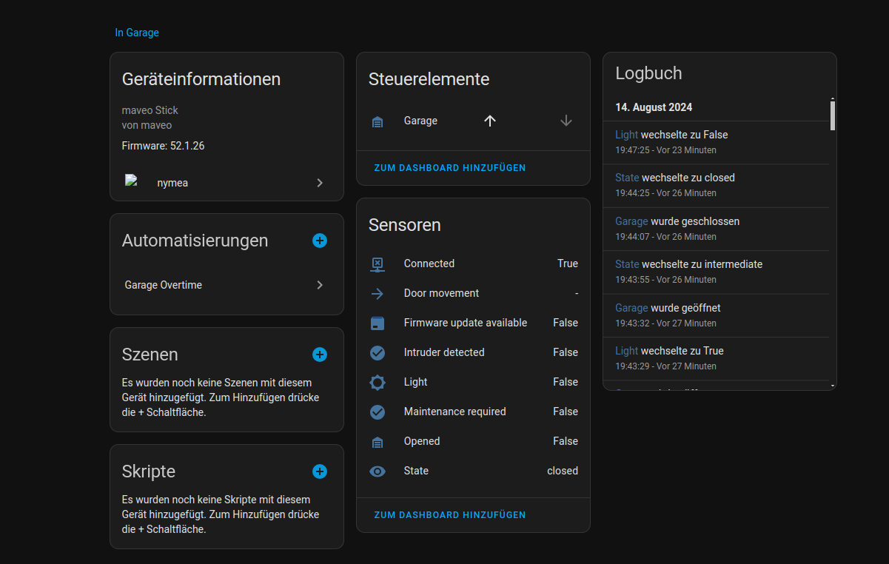
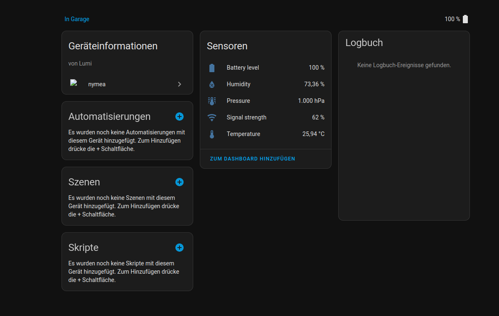

# Introduction
This is a custom integration for nymea/maveo.
It currently supports the following devices:
- maveo stick: open/close the garage and get its state
- maveo sensor: humidity and temperature sensor
- aqara weather sensor: humidity, temperature, pressure

# Screenshots

# Resources
The code for the home assistant integration is based on https://github.com/home-assistant/example-custom-config/tree/master/custom_components/detailed_hello_world_push.

The code to interact with nymea is taken from https://github.com/nymea/nymea-cli
